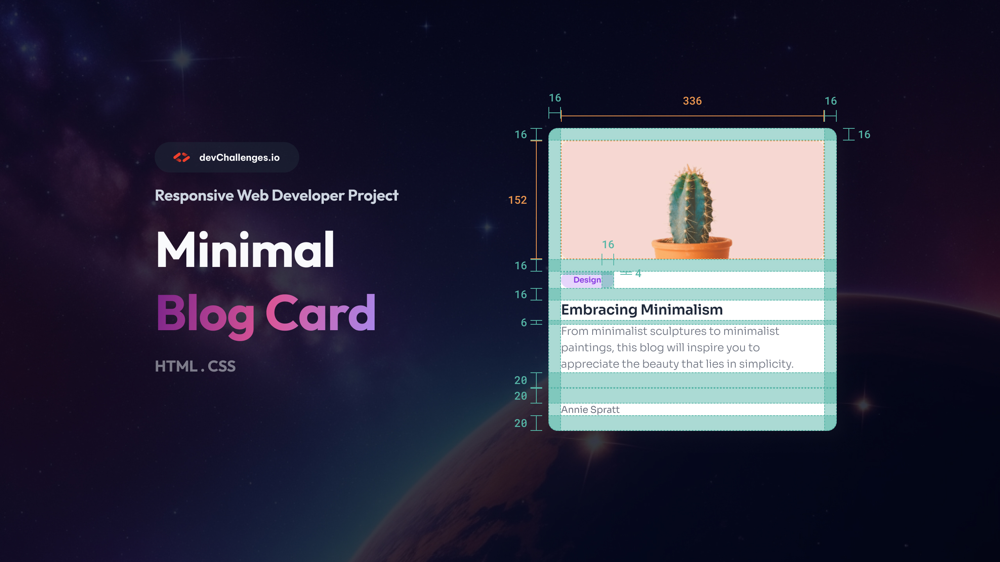

<h1 align="center">Minimal Blog Card</h1>

   Soluction for a challange from <a href="http://devchallenges.io" target="_blank">devChallenges</a>.

  <h3>
    <a href="https://alrenp.github.io/devChallenges/Responsive-Web-Developer/minimal-blog-card/">
      Project
    </a>
     | 
    <a href="https://github.com/AlRenp/devChallenges/tree/main/Responsive-Web-Developer/minimal-blog-card">
      Solution
    </a>
     | 
    <a href="https://devchallenges.io/challenge/27">
      Layout
    </a>
  </h3>

## Table of Contents

- [Overview](#overview)
- [Built With](#built-with)
- [Contact](#contact)

## Overview

### Built With

- html
- css

## Contact

- GitHub: [@Alysson](https://github.com/alrenp)
- Instagram: [@4ysson](https://instagram.com/4ysson)
